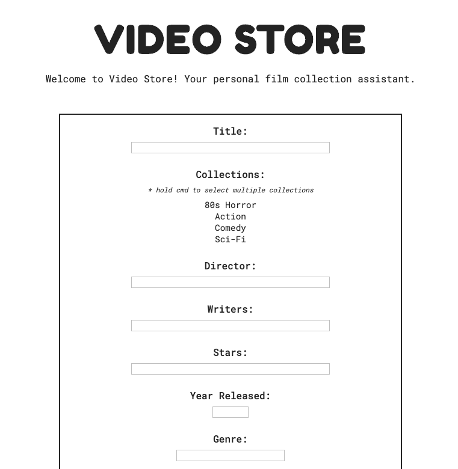
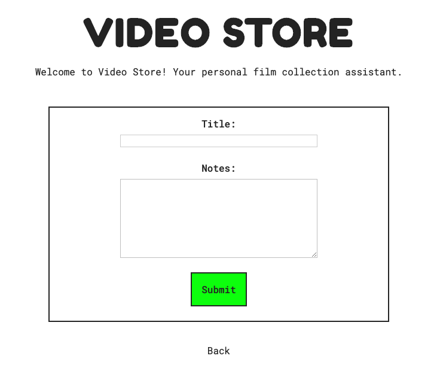
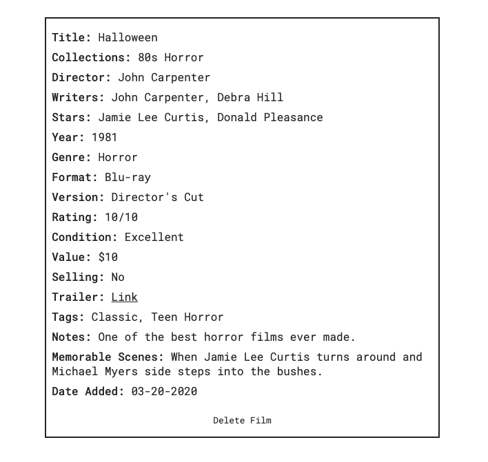
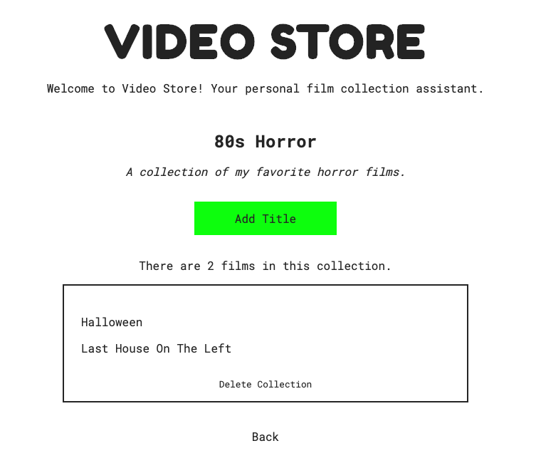
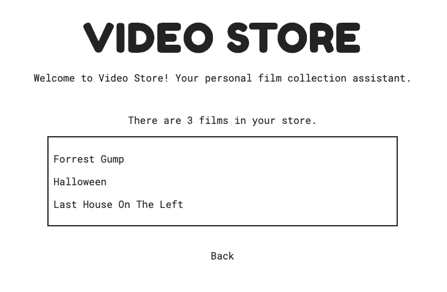

# Video Store

Video Store is an app for managing your personal film collection. Users can add film titles and collections, with any number of films belonging to any number of collections. Built with film collectors, fans, archivists and sellers/traders in mind.

  

Try it out! - https://video-store.now.sh/

## Add Title

Users can add any number of films along with optional additional information for each title.

  

**Title** - Title of the film.  
**Collections** - Which collection(s) the film belongs in. Multiple collections can be selected.  
**Director** - Director(s) of the film.  
**Writers** - Writer(s) of the film script/screenplay.  
**Stars** - Notable/featured actors in the film.  
**Year Released** - Year that film was released.  
**Genre** - Film genre(s).  
**Format** - Format of title (ie. DVD, VHS, digital, etc).  
**Version** - Version of title (ie. Original, Director's Cut, Italian dubbed, bootleg, etc).  
**Condition** - Physical condition of title (useful for selling films).  
**Value** - Value of title (useful for selling films).  
**Rating** - Rating of film on scale of user's choice (ie. 10/10, Five Stars, 2 Thumbs Up, 97).  
**Selling** - Check if marking title for sale.  
**Trailer** - URL input for link to title trailer.  
**Tags** - Custom tags for title (ie. Scary, Funny, Sad).  
**Notes** - Additional notes on film/title.  
**Memorable Scenes** - Memorable scenes from the film.

# Add Collection

Users can add any number of collections along with optional notes for each title.

  

## Film View

Clicking on a film links to a card displaying all of the information entered for that film.

  

## Collection View

Clicking on a collection links to a page displaying all of the films in that collection.

  

## All films

Clicking on 'View all films' or the VCR graphic allows user to view all films in their library or 'store'.

  

## Technology Used

### Front-end

React with React Router + Context, JS ES6, SCSS

### Back-end

Node.js w/ Express, PostgreSQL, Knex, Postgrator

### Testing

Mocha, Chai, Jest, Supertest

### Deployment

Zeit, Heroku

---

_Paul Baisley 2020_

_VCR Graphic by Nikita Golubev_
